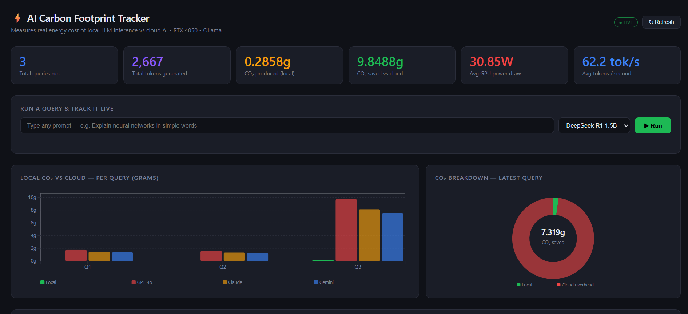

# ⚡ AI Carbon Footprint Tracker

<p align="left">
  
  
  
  
  
  
</p>

> Measures and compares the **real energy cost** of running AI models locally (Ollama + RTX 4050) versus cloud APIs (GPT-4o, Claude, Gemini) — with a live D3.js dashboard, REST API, and SQLite query logger.

Built by **Bramha Vinayak Gulavani** — CSE (AI & ML), VIT Pune | Class Representative

---

## 🌍 Why this exists

Every time you send a prompt to ChatGPT or Claude, a data center somewhere burns electricity and emits CO₂. Nobody tells you how much. Training GPT-3 alone emitted **626,000 kg of CO₂** — and inference (daily use) now dwarfs that at scale.

Local models running on consumer GPUs are the green alternative — but nobody had built a tool to actually **measure, compare, and visualize** that gap in real time.

This project does exactly that — with real hardware, real data, and zero cloud dependency.

---

## 📸 Dashboard



**What the dashboard shows:**
- Live stat cards — queries run, tokens generated, CO₂ produced, CO₂ saved, avg watts, tok/s
- Grouped bar chart — local vs GPT-4o vs Claude vs Gemini CO₂ per query
- Donut chart — CO₂ breakdown of the most recent query
- Built-in query runner — type any prompt, select model, hit Run, see live results
- Full query history table — every query logged with timestamps and full energy data

---

## 🔬 How it works

When you run a prompt, **two things happen simultaneously:**

```
You type a prompt
       │
       ├──► Ollama runs AI model on RTX 4050 GPU
       │         (DeepSeek R1 / Llama 3 / Mistral)
       │
       └──► Power Sampler reads nvidia-smi every 500ms
                 (GPU watts · temperature · utilization)
                         │
                         ▼
              CO₂ Calculator
              watt-hours × 0.82 = grams CO₂  (India grid factor)
              tokens × cloud rate = grams CO₂ (cloud estimate)
                         │
                         ▼
              SQLite Logger ──► Flask REST API ──► D3.js Dashboard
```

### The core formula

```python
# Energy consumed during query
watt_hours = avg_watts * duration_seconds / 3600

# Local CO₂ — India grid emission factor (CEA 2023)
co2_local = watt_hours * 0.82          # grams

# Cloud CO₂ estimate — per token, based on PUE research
co2_cloud = tokens * 0.0049            # grams (GPT-4o)

# CO₂ saved by running locally instead of cloud
co2_saved = co2_cloud - co2_local
```

---

## 📊 Real results — measured on my RTX 4050

| Query type | Avg GPU | Peak GPU | Tokens | CO₂ local | CO₂ GPT-4o | 💚 Saved |
|---|---|---|---|---|---|---|
| Simple question (3 sentences) | 23W | 65W | 326 | 0.055g | 1.597g | **1.184g** |
| Complex coding question | 55W | 68W | 1,980 | 0.205g | 9.702g | **7.319g** |
| **Session total (3 queries)** | **30.85W avg** | — | **2,667** | **0.286g** | **12.52g** | **9.849g** |

> **Local AI is ~47× cleaner than cloud AI for the same output.**
> Running on NVIDIA GeForce RTX 4050 · Lenovo LOQ · Windows 11

---

## 🛠️ Tech stack

| Layer | Technology |
|---|---|
| AI inference | Ollama — DeepSeek R1 1.5B · Llama 3 · Mistral |
| Power measurement | `nvidia-smi` (GPU watts) + `psutil` (CPU) |
| Backend API | Python 3.14 · Flask 3.1.3 · Flask-CORS |
| Database | SQLite (auto-created) |
| Frontend dashboard | D3.js v7 · HTML5 · CSS3 |
| Hardware | NVIDIA GeForce RTX 4050 · 6GB VRAM · 80W TDP |

---

## 🚀 Setup & installation

### Prerequisites
- Windows 11 / Linux / macOS
- NVIDIA GPU with latest drivers (`nvidia-smi` must work in terminal)
- [Ollama](https://ollama.com/download) installed and running
- Python 3.11+

### 1. Clone the repo

```bash
git clone https://github.com/bramhagulavani/ai-carbon-tracker.git
cd ai-carbon-tracker
```

### 2. Install dependencies

```bash
pip install flask flask-cors requests
```

### 3. Pull an AI model

```bash
ollama pull deepseek-r1:1.5b
```

> Other supported models: `llama3.2`, `mistral`, `deepseek-r1:7b`

### 4. Start Ollama (keep this running)

```bash
ollama serve
```

### 5. Start the Flask API (new terminal)

```bash
python app.py
```

### 6. Open the dashboard

Open `dashboard.html` directly in your browser.
No build tools. No npm. No config. Just open and go.

---

## 📁 Project structure

```
carbon-tracker/
│
├── power_sampler.py       # Reads GPU watts via nvidia-smi every 500ms
├── ollama_query.py        # Runs Ollama inference + power tracking
├── database.py            # SQLite logger — init, log, fetch, stats
├── app.py                 # Flask REST API — /query /history /stats
├── dashboard.html         # Live D3.js dashboard (single HTML file)
│
├── carbon_tracker.db      # SQLite database (auto-created on first run)
├── dashboard_preview.png  # Dashboard screenshot for README
└── README.md
```

---

## 🌐 API reference

| Method | Endpoint | Description |
|---|---|---|
| `GET` | `/` | API status + list of routes |
| `POST` | `/query` | Run a prompt — returns full energy + CO₂ report |
| `GET` | `/stats` | Lifetime summary stats (all queries ever run) |
| `GET` | `/history` | All logged queries, most recent first |

### POST /query — example

```bash
curl -X POST http://localhost:5000/query \
  -H "Content-Type: application/json" \
  -d '{"prompt": "Explain neural networks", "model": "deepseek-r1:1.5b"}'
```

**Response:**
```json
{
  "model": "deepseek-r1:1.5b",
  "tokens": 361,
  "tokens_prompt": 14,
  "wall_time_s": 5.69,
  "tokens_per_sec": 63.4,
  "avg_watts": 23.06,
  "peak_watts": 64.11,
  "watt_hours": 0.032029,
  "co2_local_g": 0.0263,
  "co2_gpt4o_g": 1.7689,
  "co2_claude_g": 1.4801,
  "co2_gemini_g": 1.3718,
  "co2_saved_g": 1.3455
}
```

### GET /stats — example response

```json
{
  "total_queries": 3,
  "total_tokens": 2667,
  "total_co2_local": 0.2858,
  "total_co2_saved": 9.8488,
  "avg_watts": 30.85,
  "avg_tokens_per_sec": 62.2
}
```

---

## 🗺️ Roadmap

**Completed:**
- [x] GPU power sampler — nvidia-smi reads every 500ms
- [x] CO₂ calculator — India grid emission factor (0.82 kg CO₂/kWh)
- [x] Ollama integration — DeepSeek R1, Llama 3, Mistral
- [x] SQLite query logger — full energy stats per query
- [x] Flask REST API — /query /history /stats endpoints
- [x] Live D3.js dashboard — charts, stat cards, query runner, history table

**Coming next:**
- [ ] Multi-model benchmark mode — same prompt → all models → CO₂ leaderboard
- [ ] Server-Sent Events (SSE) — live wattage graph during inference
- [ ] PDF report export — monthly energy + CO₂ summary
- [ ] CPU-only mode — for systems without NVIDIA GPU
- [ ] `requirements.txt` + Docker support
- [ ] Deployment guide — Render / Railway

---

## 📚 Research context

This project contributes real per-query measurement data to the emerging field of **AI sustainability**. Key references:

- Strubell et al. (2019) — *Energy and Policy Considerations for Deep Learning in NLP*
- Patterson et al. (2021) — *Carbon Emissions and Large Neural Network Training* (Google)
- India grid emission factor: **0.82 kg CO₂/kWh** — CEA, Ministry of Power (2023)
- Cloud PUE assumption: **1.58 average** — Uptime Institute Global Data Center Survey (2023)
- Cloud CO₂ per token estimates based on published inference energy benchmarks

> Planning to publish accumulated query data as a research paper on local vs cloud LLM inference energy efficiency.

---

## ⭐ If this helped you

If you found this useful or interesting, consider giving it a ⭐ on GitHub — it helps others discover the project and supports the research.

---

## 👤 Author

**Bramha Vinayak Gulavani**
- 🎓 CSE (AI & ML) · VIT Pune · Class Representative
- 🏆 CGPA 9.48 | Diploma IT — 93.7% aggregate
- 💼 [LinkedIn](https://www.linkedin.com/in/bramha-vinayak-gulavani-31302a30b/)
- 🌐 [Portfolio](https://bramhagulavani.vercel.app)
- 🐙 [GitHub](https://github.com/bramhagulavani)

---

## 📄 License

MIT License — free to use, modify, and distribute with attribution.

---

<p align="center">
  <i>Built with an RTX 4050, Ollama, and the belief that AI should be measurably sustainable.</i>
</p>